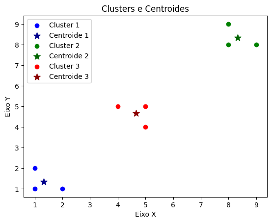

# Desafio: Implementação de K‑Means em Python
Este repositório contém o notebook **desafio_gabarito.ipynb**, que apresenta uma implementação do algoritmo de agrupamento **K‑Means** do zero, usando apenas bibliotecas básicas em Python.

## 📁 Visão geral do conteúdo
- `desafio_gabarito.ipynb`: Notebook com o passo‑a‑passo da implementação:
  1. Carregamento dos dados (atributos `x` e `y`)
  2. Inicialização dos centróides
  3. Cálculo da matriz de distâncias dos pontos aos centróides
  4. Atribuição de cada ponto ao cluster mais próximo
  5. Reavaliação e atualização dos centróides
  6. Critério de parada (quando os centróides deixam de mudar ou número máximo de iterações)
  7. Visualização gráfica dos clusters resultantes

## 🧮 Sobre o algoritmo K‑Means
O K‑Means é um método de aprendizado não supervisionado para partição de dados em k clusters. A ideia central:
- Definir k centróides (inicialmente de forma arbitrária ou aleatória)
- Repetir até convergência:
  - Atribuir cada ponto ao centróide mais próximo
  - Recalcular os centróides como as médias dos pontos de cada cluster
- Parar quando os centróides não mudam ou mudam pouco

A implementação neste notebook mostra manualmente essas etapas para fins didáticos.

## 🛠 Como usar
1. Clone o repositório:
   ```bash
   git clone https://github.com/Matheus0820/pesquisa_machine_leaning_e_materiais.git
   ```
2. Navegue até a pasta:
   ```bash
   cd pesquisa_machine_leaning_e_materiais/Etapa_1/Algoritmos_Matheus/
   ```
3. Abra o notebook `desafio_gabarito.ipynb` no Jupyter Notebook, JupyterLab ou VS Code com extensão de notebooks.
4. Verifique as bibliotecas necessárias (por exemplo, `numpy`, `pandas`, `matplotlib`) e execute as células sequencialmente.
5. Observe os resultados e o gráfico final que visualiza os clusters formados.

## ✅ Pontos de atenção
- A inicialização dos centróides influencia bastante a convergência e a qualidade final do agrupamento.
- Deve-se garantir que nenhum cluster fique vazio (ou seja, sem pontos atribuídos), o que pode levar a cálculos de médias inválidas (NaN).
- É recomendado definir um critério de parada: por exemplo, mudança mínima entre centróides ou número máximo de iterações.
- O código pode ser adaptado para mais de 2 dimensões ou para outro número de clusters (além de 3).

## 🧭 Melhorias futuras
- Implementar o método de inicialização **K‑Means++** para escolher centróides inicializados mais inteligentemente.
- Permitir a entrada de dados com mais variáveis (multidimensionais).
- Incorporar métricas de avaliação (como inércia, silhueta) para medir a qualidade do agrupamento.
- Tornar o algoritmo mais modular, aceitável para quaisquer k e qualquer dataset, com validação de entrada.

## 📊 Resultados

Após executar o algoritmo K-Means implementado neste notebook, obtemos a seguinte visualização dos clusters e centróides:



- Cada ponto colorido representa um elemento do dataset atribuído a um cluster específico:
  - **Azul** → Cluster 1
  - **Verde** → Cluster 2
  - **Vermelho** → Cluster 3
- Cada estrela escura representa o **centróide** correspondente de cada cluster.
- É possível observar que os pontos foram agrupados corretamente em torno de seus centróides, demonstrando a eficácia do algoritmo.


## 📝 Licença
Este projeto está aberto para uso educacional e experimental. Sinta‑se à vontade para copiar, modificar e aprender com o conteúdo. Caso reutilize ou publique, agradece‑se manter a atribuição ao autor original.
